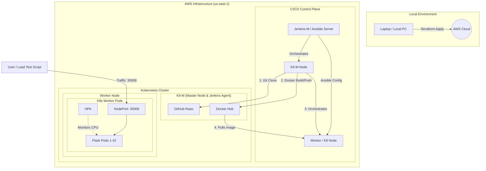

# 🚀 AWS Cloud-Scaling Infrastructure & Real-Time Pod Monitoring

  

## 📝 Project Overview
This project demonstrates a high-availability cloud modernization journey. We migrated a static monolithic site into a dynamic **Python Flask microservice** that provides real-time observability of Kubernetes pod resources. [cite_start]The infrastructure is fully automated via **CI/CD (Jenkins)** and is designed to self-heal and scale horizontally based on live traffic demands.

## 🏗️ System Architecture
This diagram represents the automated lifecycle from infrastructure provisioning via **Terraform** to configuration management via **Ansible** and deployment via **Kubernetes**.

## 🏗️ Architecture & Tech Stack
* **Cloud Platform**: AWS (EC2/EKS)
* **Orchestration**: Kubernetes (Deployments, NodePort Service, HPA)
* **CI/CD**: Jenkins Pipeline with Docker Hub integration
* **Application**: Python 3.9 Flask app utilizing `psutil` for system metrics
* **Containerization**: Docker (Alpine-based lightweight images)

## ⚡ Key Features
* **Dynamic Monitoring**: A live web dashboard showing real-time CPU and Memory usage per pod.
* **Horizontal Pod Autoscaling (HPA)**: Automatically scales the application from **2 to 10 replicas** when CPU usage exceeds 50%.
* **Zero-Downtime Reliability**: Implemented Rolling Updates and Readiness Probes to ensure the application remains online during deployments.
* **Automated Versioning**: Jenkins automatically injects the Build ID into the application UI at runtime for full traceability.

## 🛠️ Challenges Faced & Solutions

### 1. The "Metrics API Not Available" Error
* **Challenge**: After setting up HPA, the targets showed `<unknown>/50%`, and `kubectl top pods` failed.
* **Solution**: Successfully installed the **Kubernetes Metrics Server**. Because the cluster used self-signed certificates, I had to patch the metrics-server deployment with the `--kubelet-insecure-tls` flag to enable secure communication between the API and the nodes.

### 2. Python Environment Conflicts (PEP 668)
* **Challenge**: While running the load test script on Ubuntu, the `pip install` command failed with an `externally-managed-environment` error.
* **Solution**: Implemented a **Python Virtual Environment (`venv`)** to isolate the project dependencies (`requests`), ensuring a clean installation without risking OS-level stability.

### 3. CI/CD Pipeline Syntax
* **Challenge**: Encountered "Unsupported map entry expression" errors in Jenkins when incorporating metadata into the pipeline script.
* **Solution**: Cleaned the `Jenkinsfile` Groovy syntax, ensuring all shell commands (`sh`) and environment variables were correctly formatted for the Jenkins DSL.

## 🚀 How to Run the Stress Test
To see the autoscaling in action, I developed a multi-threaded **Load Test script**:

1.  **Activate Environment**: `source loadtest_env/bin/activate`
2.  **Run Test**: `python3 load_test.py`
3.  **Monitor Scaling**:
    * Watch the web dashboard rise to ~70%+ CPU usage.
    * Watch terminal: `kubectl get hpa -w` to see replicas jump from 2 to 10.

---

### 🔗 Project Links
* **GitHub Repository**: [mahesh-devops24/aws-cloud-scaling-infra](https://github.com/mahesh-devops24/aws-cloud-scaling-infra.git)
* **Deployment Port**: NodePort 30008

---
